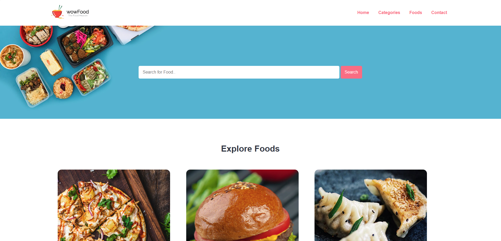

# PHP Food Order Project

A beginner web development project that demonstrates the structure and design of a restaurant food ordering website using HTML, CSS, and PHP.

The project includes multiple interconnected pages, food categories, menu listings, search page layouts, and an early administrative page implemented in PHP.



## Features

- Restaurant home page with navigation, food search, categories, and menu sections
- Food category listing page
- Food menu listing page
- Category-based food page layout
- Food search page layout
- Basic order form with customer delivery details
- Responsive design for smaller screens
- Image-based food cards and menu items
- Social media icon links in the footer area
- Basic admin page placeholder created with PHP
- Lightweight multi-page project structure

## Pages

- `index.html` - main restaurant landing page
- `categories.html` - food category listing page
- `foods.html` - food menu page
- `category-foods.html` - category food listing page
- `food-search.html` - food search page
- `order.html` - order form page
- `admin/index.php` - admin dashboard placeholder page

## Tech Stack

### Frontend

- HTML
- CSS
- Responsive layout with media queries

### Backend

- PHP

## Key Concepts

- Multi-page website structure
- Responsive web design
- Navigation systems
- Form design and user input handling
- CSS organization and reusable components
- Project folder structure
- Basic PHP page structure

## Project Structure

```text
PHP-Food-Order-Project/
|-- admin/
|   `-- index.php
|-- css/
|   |-- admin.css
|   `-- style.css
|-- images/
|   |-- bg.jpg
|   |-- burger.jpg
|   |-- logo.png
|   |-- menu-burger.jpg
|   |-- menu-momo.jpg
|   |-- menu-pizza.jpg
|   |-- momo.jpg
|   `-- pizza.jpg
|-- categories.html
|-- category-foods.html
|-- food-search.html
|-- foods.html
|-- index.html
|-- order.html
|-- preview.png
`-- README.md
```

## Setup and Run

### Prerequisites

- XAMPP or another local web server

### Run the Project

1. Place the project folder inside the XAMPP `htdocs` directory.
2. Start Apache from the XAMPP Control Panel.
3. Open the project in your browser:

```text
http://localhost/PHP-Food-Order-Project/
```

4. To view the admin placeholder page, open:

```text
http://localhost/PHP-Food-Order-Project/admin/
```

## Purpose

This project was created while learning web development fundamentals and helped develop skills in HTML, CSS, PHP, page navigation, responsive layouts, forms, and project organization.

## Notes

This repository represents an early learning project and primarily focuses on frontend structure and design.

Features such as order processing, database integration, user authentication, and dynamic search functionality were not implemented and are represented by static layouts and placeholders.

Some content and images are sample/demo data used for learning purposes.

## Project Status

This repository is maintained as an archive of an early web development project and is no longer under active development.
